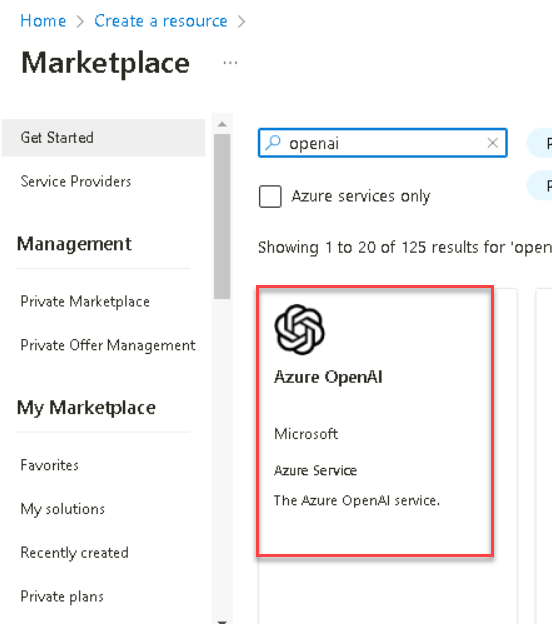
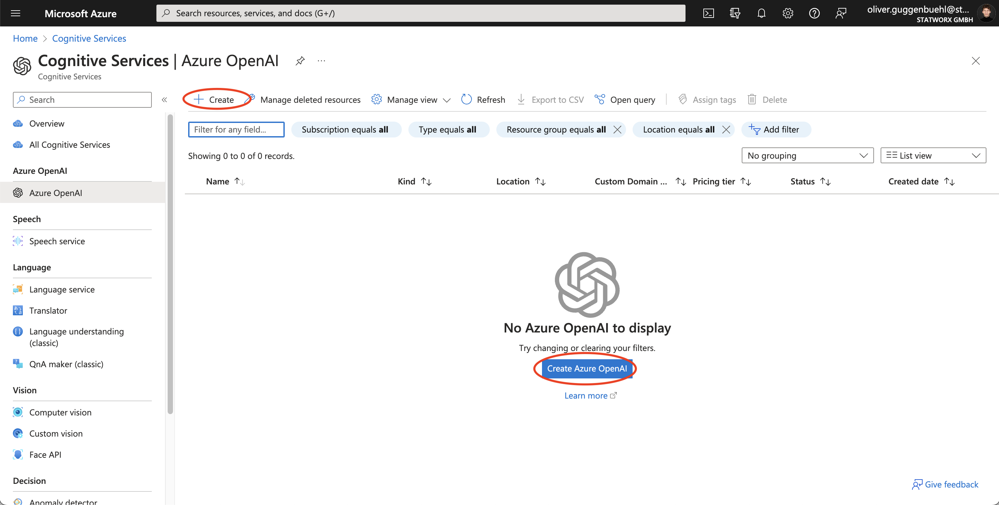
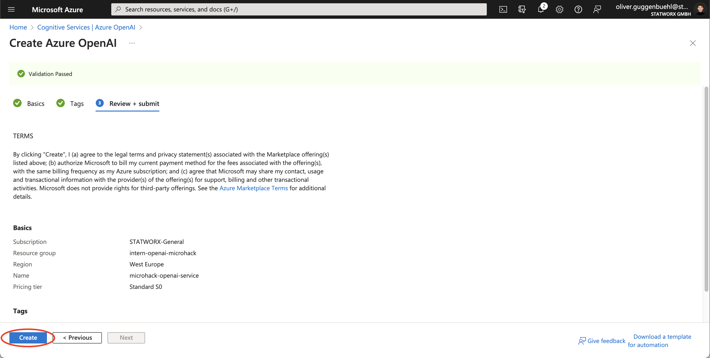
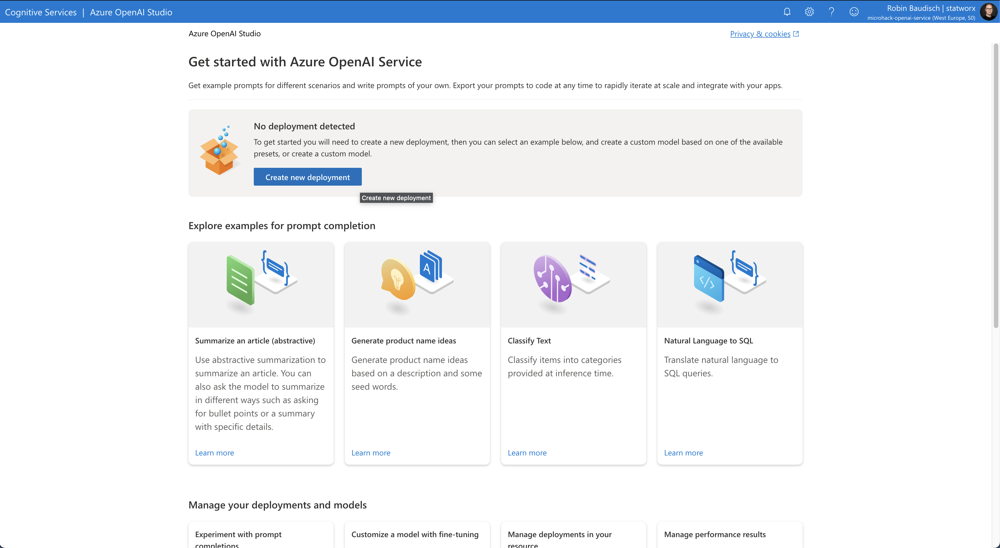
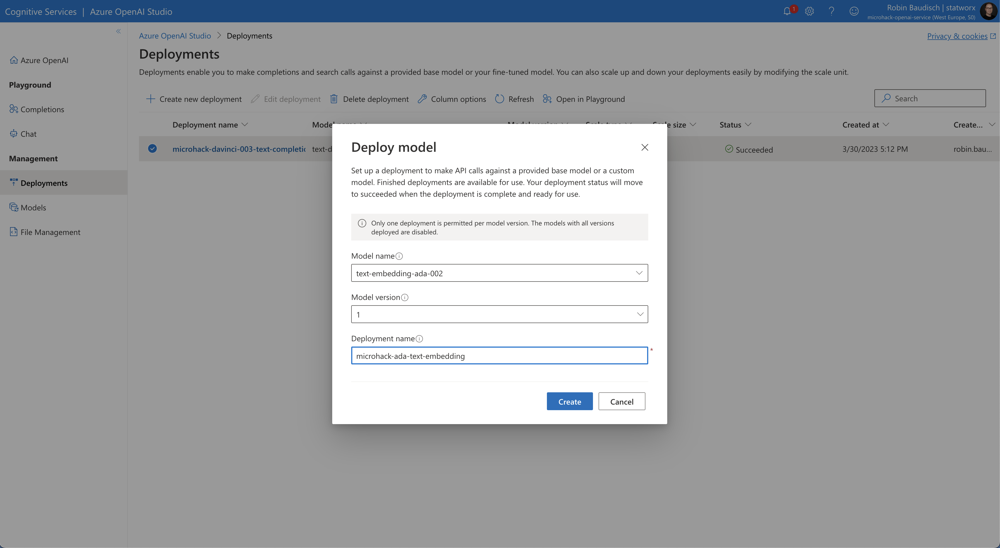

## Task 1: Setup the Azure OpenAI Service

1. Launch Chrome, and then login to the Azure portal using your Azure credentials. Click the cloud icon in the lab player to retrieve them.

  ```
  https://portal.azure.com
  ```

1. In order to work with the GPT models from OpenAI, we need to create the Azure OpenAI service and deploy the models we will be using. Click the **Create a resource** button and search for *openai* in the search bar and select the **Azure OpenAI** service.



1. This will take you to the **Cognitive Services | Azure OpenAI** subpage, either click on *+ Create* at the top of the page or on *Create Azure OpenAI*.



1. On the configuration page, select the correct Azure Subscription under *Project Details*. You need to specify the Resource Group under which you want the Azure OpenAI resource to be situated. Under *Instance Details* you need to select a deployment region, name the Azure OpenAI service and decide on the pricing tier. We selected **West Europe**, gave the Azure OpenAI service a fitting name and chose the default pricing tier.

1. The next step is to click on **Review + create**. We once again do not modify the standard selections under the tabs **Network**, **Identity** or **Tags**. If you are handling sensitive data or have specific networking needs, please consult the official Azure resources.


1. Next, Azure is prompting us to give the resource some tags that make it easier to differentiate between multiple instances of the same service. Which tags you want to set and how to name their values is entirely up to you.


1. On the Review page, click on Create if you are happy with your configuration. It should take you to the deployment page of the Azure OpenAI service. Deployment might take an unexpectedly long time for this particular resource - do not be surprised if it takes over an hour to finish deployment.



1. Since the Service has just been created, on the main page of the Azure OpenAI Studio it will let you know that you have currently no models deployed. Click on *Create new deployment*.


1. In the newly opened window, you are asked to select one of several different OpenAI models for deplyoment. These models are dividable by their parameter size (Ada is the smallest models while Davinci is the largest) and their respective use cases. There are different models for creating text embeddings, code embeddings or text/code generation. 

> For a complete list of available models, refer to [Azure OpenAI Service models](https://learn.microsoft.com/en-us/azure/cognitive-services/openai/concepts/models#model-summary-table-and-region-availability).

1. Since we want to create embeddings of documents and user queries with the goal of retrieving relevant sections of our uploaded documents with regards to the query, we need to deploy a text search embedding model. We select **text-embedding-ada-002**, the newest embedding model from OpenAI which creates embeddings with 1536 dimensions.

1. Under **Deployment Name**, give the model a fitting name. Deployment names are the ones we will specify in our code.



1. Lastly, we need a text generation model which will output the response to the user query. For this, we chose **gpt-3.5-turbo**. Also provide a name to utilize later.  


The two models we just deployed will be usable in our Azure Function and our Frontend.

# Exercises

In this document, you find a few exercises for practicing prompt engineering. For each exercise, you'll get some input text and then an expected completion. You task is to write the prompt to achieve the expected completion.
___

## Exercise 1 - German Translation

* Exercise: Write a prompt that generates the expected completion
* Input text: `I was enjoying the sun, but then a huge cloud came and covered the sky.`
* Expected completion: `Ich genoss die Sonne, aber dann kam eine riesige Wolke und bedeckte den Himmel.`


___

## Exercise 2 - Negation

* Exercise: Write a prompt that generates the expected completion
* Input text: `I was enjoying the sun, but then a huge cloud came and covered the sky.`
* Expected completion: `I was not enjoying the sun, and then a huge cloud did not come and cover the sky.`

___

## Exercise 3 - Classification

* Exercise: Write a prompt that generates the expected completion
* Input text: `Not much to write about here, but it does exactly what it's supposed to. filters out the pop sounds. now my recordings are much more crisp. it is one of the lowest prices pop filters on amazon so might as well buy it, they honestly work the same despite their pricing.`
* Expected completion (or similar):

  ``` 
  Positive: 0.75
  Neutral: 0.20
  Negative: 0.05
  ```


___

## Exercise 4 - E-Mail Summarization

* Exercise: Write a prompt that generates the expected completion
* Input text: Use your own email...
* Expected completion (or similar):

  ``` 
  Summary: XYZ
  Open Questions: XYZ
  Action Items: XYZ 
  ```


## Exercise 5 - Rewriting

* Exercise: Write a prompt that generates the expected completion
* Input text: `I was enjoying the sun, but then a huge cloud came and covered the sky.`
* Expected completion: `She was enjoying the sun, but then a huge cloud came and covered the sky.`


## :question: Exercise 6 - Multiple Tasks

* Exercise: Write a prompt that generates the expected output
* Input text: `I was enjoying the sun, but then a huge cloud came and covered the sky.`
* Expected output:

  ```
  {
    "translated": "Ich genoss die Sonne, aber dann kam eine riesige Wolke und bedeckte den Himmel.",
    "negated": "I was not enjoying the sun, and no huge cloud came and covered the sky.",
   "third_person": "She was enjoying the sun, but then a huge cloud came and covered the sky."
  }
  ```


___

## Exercise 7 - Data extraction to JSON

* Exercise: Write a prompt that generates the expected output

* Input text:

  ```
  Hello, my name is Mateo Gomez. I lost my Credit card on August 17th, and I would like to request its cancellation. The last purchase I made was of a Chicken parmigiana dish at Contoso Restaurant, located near the Hollywood Museum, for $40. Below is my personal information for validation:
  Profession: Accountant
  Social Security number is 123-45-6789
  Date of birth: 9-9-1989
  Phone number: 949-555-0110
  Personal address: 1234 Hollywood Boulevard Los Angeles CA
  Linked email account: mateo@contosorestaurant.com
  Swift code: CHASUS33XXX
  ```
* Expected output:
  ```
  {
      "reason": "Lost card",
      "classified_reason": "lost_card",
      "name": "Mateo Gomez",
      "ssn": "123-45-6789",
      "dob": "09/09/1989"
  }
  ```


## Exercise 8 - Fashion product description

* Exercise: Write a prompt that generates the expected completion
* Input text:
  ```
  Season: Winter
  Style: Sweater
  Gender: Female
  Target group: Teenager
  Material: Cotton
  ```
* Expected completion (or similar):
  ```
  Stay warm and stylish this winter with our cozy cotton sweaters, perfect for the fashion-forward teenager. Refresh your wardrobe with the latest winter styles from our collection.
  ```

## Exercise 9 - Write a Blog Post

* Exercise: Write a blog post about a topic of your choice
* Input text: You choose
* Expected completion: a blogpost with hashtages

## Exercise 10 - Call Center

* Exercise: Analyze a call center conversation
* Input text:
  ```
  Employee: "Hello, this is Julia Schreider from Contoso Company. How can I help you today?"
  Customer: "Hi, I am Carsten Mueller. I ordered a package 10 days ago, on February 10th, and it was supposed to arrive in maximum 5 business days. I have called three times already and nobody could provide any more information. I want to know where the package is and I want the problem to be solved immediately. This is the worst service I had for a long time!"
  Employee: "I apologize for the inconvenience, Mr. Mueller. I understand your frustration and I'm here to help. Can you please provide me with your order number so I can look into this for you?"
  Customer: "Yes, it's ACZ456789."
  Employee: "Thank you. I'm looking into it now. Can you please hold for a few minutes while I check the status of your package?"
  Customer: "Okay."
  Employee: "Thank you for your patience. I am sorry to inform you that I am unable to find the status of your package. It appears to have left the sending address, but no up-to-date status on the current location. I will further investigate your case and get back to you as soon as possible via phone call. Could you please provide me your contact information?"
  Customer: "Ah not again. Anyway, my phone number is +4911112223344."
  Employee: "I apologize again for the inconvenience. Is there anything else I can help you with today?"
  Customer: "No."
  Employee: "Thank you. Have a great day!"
  ```
* Expected output:
  ```
  {
      "classified_reason": "lost_package",
      "resolve_status": "unresolved",
      "call_summary": "Customer ordered package 10 days ago and has not received it yet.",
      "customer_name": "Carsten Mueller",
      "employee_name": "Julia Schreider",
      "order_number": "ACZ456789",
      "customer_contact_nr": "+4911112223344",
      "new_address": "N/A",
      "sentiment_initial": ["angry", "frustrated"],
      "sentiment_final": ["calm"],
      "satisfaction_score_initial": 0,
      "satisfaction_score_final": 5,
      "eta": "N/A",
      "action_item": ["track_package", "inquire_package_status", "contact_customer"]
  }
  ```


## Exercise 11 - Few-shot learning

* Exercise: Write a few-shot learned prompt that classifies a movie summary.
* Data samples:
  ```
  Paul Atreides, a brilliant and gifted young man born into a great destiny beyond his understanding, must travel to the most dangerous planet in the universe to ensure the future of his family and his people. As malevolent forces explode into conflict over the planet's exclusive supply of the most precious resource in existence-a commodity capable of unlocking humanity's greatest potential-only those who can conquer their fear will survive.
  ['Action', 'Adventure', 'Science Fiction’]

  A botched store robbery places Wonder Woman in a global battle against a powerful and mysterious ancient force that puts her powers in jeopardy.
  ['Action', 'Adventure', 'Fantasy']

  After the devastating events of Avengers: Infinity War, the universe is in ruins due to the efforts of the Mad Titan, Thanos. With the help of remaining allies, the Avengers must assemble once more in order to undo Thanos' actions and restore order to the universe once and for all, no matter what consequences may be in store.
  ['Adventure', 'Science Fiction', 'Action']

  A widowed new dad copes with doubts, fears, heartache and dirty diapers as he sets out to raise his daughter on his own. Inspired by a true story.
  ['Drama', 'Family', 'Comedy’]

  New data:
  Harry, Ron and Hermione walk away from their last year at Hogwarts to find and destroy the remaining Horcruxes, putting an end to Voldemort's bid for immortality. But with Harry's beloved Dumbledore dead and Voldemort's unscrupulous Death Eaters on the loose, the world is more dangerous than ever.
  ```
* Expected completion: Classification of the new data point


___

## Exercise 12 - NL to SQL with Codex

* Exercise: Write a prompt that generates the expected SQL statement
* Table information:
  * Table: customer // Columns: firstname, name, customer_id, address
  * Table: orders // Columns: order_id, customer_id, product_id, product_amount
  * Table: products // Columns: product_id, price, name, description
* Expected completion: a query that returns the top 10 orders and show the customer name

