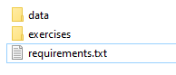
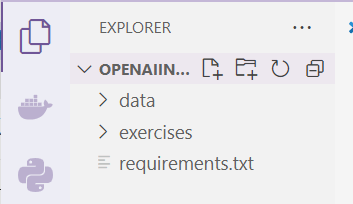
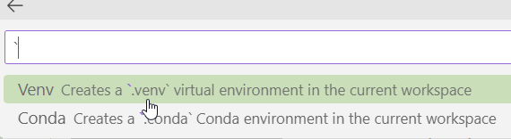
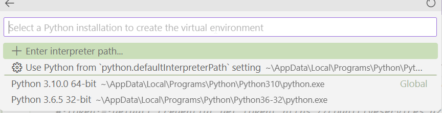
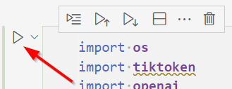

# Quickstart

1. Start by downloading, and extracting, the required files from this [location](This%20notebook%20is%20just%20to%20make%20sure%20that%20everything%20works.)

1. The files should resemble the following after extraction

    
    
1. In VS Code open the folder where these files are. 

    
    
1. Expand the exercises folder and double-click the quickstart.ipynb to open the notebook file.

1. You will probably be prompted to allow a couple of extensions to be setup.

1. In the upper-right hand corner the Kernel needs to be selected

    
    
1. Click on the Select Kernel button to choose the Python environment you wish to use. Tested on Python 3.10.0. Select **Create Python Environment**

    
    
    
    
1. Create a **Venv**

    
    
1. Select Python 3.10.0

    
    
1. Select the requirements.txt file

    
    
1. Let the packages required install

    
    
1. First, create a file called **.env** in the **exercises** folder, and add the following content

```console
    OPENAI_API_KEY=xxxxxx
    OPENAI_API_BASE=https://xxxxxxx.openai.azure.com/
```
1. There are two different ways to authenticate but the code has been updated to use the Access Key authentication. The requirements file has also been updated for Python versions greater than 3.9

1. To execute a cell click on the triangle on the left side of the cell.

    

